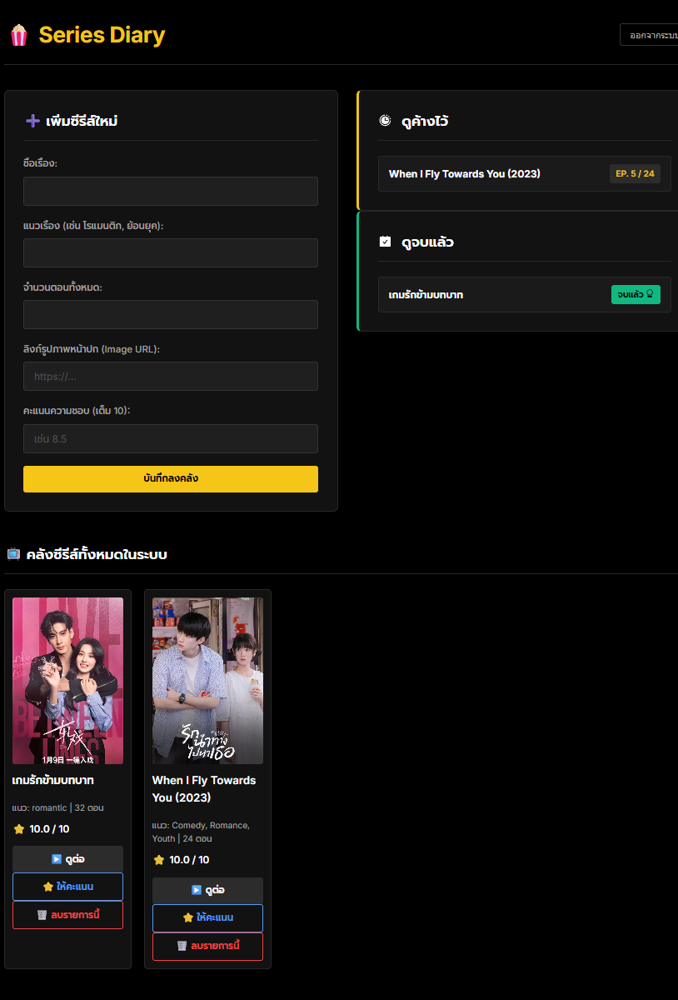

# 🍿 Series Diary - Frontend (React)

The modern, responsive, and user-friendly frontend for the **Series Diary** application. Built with **React** and designed with an elegant **Dark Theme (IMDb-inspired)** to provide a premium binge-watching tracking experience.

## ✨ Key Features
* **Intelligent Dashboard**: Automatically categorizes your series into "🕒 Currently Watching" and "✅ Completed" based on your episode progress.
* **Full CRUD Operations**: Support for adding new series (with cover image URLs), updating watch progress, rating your favorites (1-10 scale), and removing entries from your library.
* **JWT Authentication Flow**: Secure login and registration system that manages user states and automatically attaches JSON Web Tokens (JWT) to API headers.
* **Premium UI/UX**: A sleek, modern user interface utilizing CSS Grid and Flexbox for responsive layouts, enhanced with `react-icons` for a polished look.
* **Dynamic Routing**: Seamless client-side page transitions using `react-router-dom` for a smooth Single Page Application (SPA) experience.

## 🛠 Tech Stack
* **Core Framework**: React.js
* **Build Tool**: Vite (for fast, optimized bundling)
* **Routing**: React Router DOM (v6)
* **HTTP Client**: Axios (for communication with the Go backend)
* **Icons**: React Icons (`react-icons/fa`, `react-icons/pi`, `react-icons/ai`, `react-icons/bs`)
* **Styling**: Custom CSS3 (Vanilla CSS)

## 📸 Preview


## 🏗 Project Structure
```text
/src
 ├── /pages
 │    ├── Home.jsx      - Main dashboard for tracking and managing series
 │    ├── Login.jsx     - User authentication page
 │    ├── Register.jsx  - New user account creation
 ├── App.jsx            - Global application routing configuration
 ├── index.css          - Global styles and UI component classes
 └── main.jsx           - React application entry point
```

## 🔧 Installation & Setup

**1. Clone the repository**:
```bash
git clone [https://github.com/Paradon-Kin/Series-Diary-front.git](https://github.com/Paradon-Kin/Series-Diary-front.git)
cd Series-Diary-front
```

**2. Install dependencies**:
Ensure you have Node.js installed, then run:
```bash
npm install
```
*(Note: If `react-icons` is missing, you can install it via `npm install react-icons`)*

**3. Configure Backend Connection**:
The application is configured to make API calls to `http://localhost:8080`. Please ensure that your Go backend (`Series-Diary-back`) is running locally.

**4. Start the development server**:
```bash
npm run dev
```
Open your browser and navigate to `http://localhost:5173` to start using the app!

---
Developed by **Paradon Saelee** as part of a Full-Stack development portfolio.